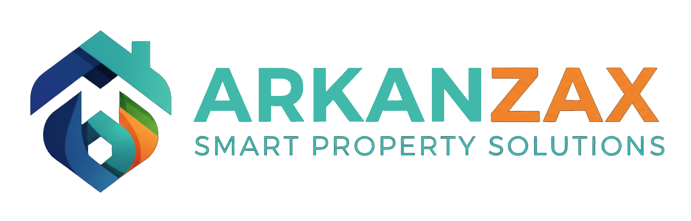

<p align="center">
  
</p>

<h1 align="center">Arkanzax — AI-Powered Software House</h1>

<p align="center">
  Full-stack Laravel 12 website with bilingual (EN/AR) support, external CMS API integration, and a complete admin dashboard.
</p>

---

## 📋 Table of Contents

- [Overview](#overview)
- [Tech Stack](#tech-stack)
- [Features](#features)
- [Project Structure](#project-structure)
- [Prerequisites](#prerequisites)
- [Installation](#installation)
- [Configuration](#configuration)
- [Running Locally](#running-locally)
- [Testing the Dashboard](#testing-the-dashboard)
- [API Integration](#api-integration)
- [Deployment](#deployment)
- [Available Routes](#available-routes)
- [License](#license)

---

## Overview

Arkanzax is a corporate software house website built with **Laravel 12**. The frontend was originally a set of static HTML/CSS/JS pages and was converted into Blade templates powered by the Laravel framework. Dynamic content (blogs, offers, jobs, portfolios, testimonials, etc.) is fetched from an external **SEO Panel CMS API** at `https://admin.arkanzax.com`.

---

## Tech Stack

| Layer         | Technology                                         |
| ------------- | -------------------------------------------------- |
| **Framework** | Laravel 12 (PHP 8.2+)                              |
| **Frontend**  | Blade Templates, Vanilla CSS, Vanilla JS           |
| **Fonts**     | Google Fonts (Outfit, Inter, Cairo for Arabic)      |
| **Icons**     | Font Awesome 6                                     |
| **Database**  | SQLite (default) / MySQL (production)              |
| **Cache**     | Database cache driver (configurable to Redis)       |
| **API**       | External REST API — SEO Panel CMS v1.0.0           |
| **Auth**      | Custom admin middleware with session-based login     |

---

## Features

### 🌐 Public Website
- **Complete Product Restoration** — Property Management, Marketing Tools, and E-Commerce pages now feature 100% of their original static content restored into high-performance Blade views.
- **Bilingual support** — Full EN/AR with RTL layout switching via JavaScript.
- **Dynamic content** — Blogs, Offers, Items, Jobs, Portfolios, Testimonials, Contact form — all fetched from external API.
- **E-commerce** — Checkout system with coupon validation, receipt upload, and order tracking.
- **Invoice modal** — Request invoice form with success state.
- **Responsive design** — Mobile-first with hamburger menu, mega menus, scroll-to-top.
- **Maintenance/Kill Switch** — Built-in security toggle via environment variables to control site access.

### 🔒 Admin Dashboard
- Full CRUD management for: Blogs, Blog Categories, Offers, Offer Types, Items, Item Types, Jobs, Team Members, Portfolios, Portfolio Categories, Sliders, Testimonials, Subscribers, Contact Messages, Orders, Coupons, Payment Methods, Clients, Settings, Social Integrations, AI Settings, Sitemaps
- Location management: Countries → States → Cities
- Lead magnet system
- Dashboard analytics with stat cards

### 🔌 API Integration
- Centralized `ApiService` with retry logic, caching (5 min TTL), and error logging
- Authentication via `X-API-KEY` and `X-Tenant-ID` headers
- Supports GET, POST, PUT, DELETE, and multipart file uploads

---

## Project Structure

```
arkanzax-laravel/
├── app/
│   ├── Http/Controllers/
│   │   ├── Admin/              # Admin CRUD controllers (25+ controllers)
│   │   ├── HomeController.php  # Homepage with API data
│   │   ├── BlogController.php  # Blog listing & detail
│   │   ├── PageController.php  # Static service/product pages
│   │   ├── ContactController.php
│   │   ├── JobController.php
│   │   ├── PortfolioController.php
│   │   ├── CheckoutController.php
│   │   └── ...
│   ├── Http/Middleware/
│   │   └── AdminAuth.php       # Admin auth middleware
│   └── Services/
│       └── ApiService.php      # Centralized API client
├── config/
│   └── api.php                 # API configuration
├── public/
│   ├── css/style.css           # Main stylesheet (3000+ lines)
│   ├── js/main.js              # Main JavaScript
│   └── assets/                 # Images, logos, client assets
├── resources/views/
│   ├── layouts/
│   │   └── app.blade.php       # Main layout (header, footer, nav)
│   ├── pages/                  # 17 static service/product pages
│   ├── admin/                  # Admin panel views
│   ├── blogs/                  # Blog listing/detail
│   ├── jobs/                   # Job listing/detail
│   └── ...
├── routes/
│   └── web.php                 # All routes (150+ lines)
├── .env                        # Environment configuration
├── render.yaml                 # Render.com Blueprint for one-click deployment
├── build.sh                    # Automated build script for production environments
└── seo-panel-api-v1.0.0.postman_collection.json  # API documentation
```

---

## Prerequisites

- **PHP** ≥ 8.2 with extensions: `mbstring`, `openssl`, `pdo`, `tokenizer`, `xml`, `ctype`, `json`, `bcmath`, `curl`, `sqlite3`
- **Composer** ≥ 2.x
- **Node.js** ≥ 18 (optional, only if you modify frontend assets)
- **SQLite** (default) or **MySQL** 8.x (for production)

---

## Installation

```bash
# 1. Clone the repository
git clone https://github.com/Kerolosnady1/Arkanzax.git
cd arkanzax-laravel

# 2. Install PHP dependencies
composer install

# 3. Copy environment file
cp .env.example .env
# On Windows: copy .env.example .env

# 4. Generate application key
php artisan key:generate

# 5. Create SQLite database (default)
# The file database/database.sqlite should already exist.
# If not: New-Item database/database.sqlite -ItemType File

# 6. Run migrations
php artisan migrate

# 7. (Optional) Seed the database
php artisan db:seed
```

---

## Configuration

Edit the `.env` file to set your API credentials:

```env
# SEO Panel CMS API
API_BASE_URL=https://admin.arkanzax.com/a/public/api/v1
API_KEY=your-api-key-here
API_TENANT_ID=3

# Admin Credentials
ADMIN_USER=your-admin-email@example.com
ADMIN_PASSWORD=your-secure-password

# Site Security (Kill Switch)
SITE_STATUS=active              # Set to 'locked' to deactivate the site
```

### API Configuration Explained

| Variable       | Description                                          |
| -------------- | ---------------------------------------------------- |
| `API_BASE_URL` | Base URL of the SEO Panel CMS API                    |
| `API_KEY`      | API key for authentication (sent as `X-API-KEY`)     |
| `API_TENANT_ID`| Tenant ID for multi-tenant isolation (`X-Tenant-ID`) |

---

## Running Locally

```bash
php artisan serve
```

Visit: **http://127.0.0.1:8000**

---

## Testing the Dashboard

The admin dashboard is a **local admin panel** integrated into the Laravel app. Here's how to access and test it:

### 1. Access the Admin Login
Navigate to: **http://127.0.0.1:8000/admin/login**

### 2. Login Credentials
Use the credentials defined in your `.env` file:
- **Email**: Value of `ADMIN_USER` (default: `m.ark4seller@gmail.com`)
- **Password**: Value of `ADMIN_PASSWORD` (default: `123123`)

### 3. Dashboard Features
After logging in, you'll see the admin dashboard at `/admin/dashboard` with:

| Section              | URL                              | Description                    |
| -------------------- | -------------------------------- | ------------------------------ |
| Dashboard            | `/admin/dashboard`               | Stats overview & analytics     |
| Blog Categories      | `/admin/blog-categories`         | Manage blog categories         |
| Blogs                | `/admin/blogs`                   | Create/edit/delete blogs       |
| Offer Types          | `/admin/type-offers`             | Manage offer types             |
| Offers               | `/admin/offers`                  | Create/edit/delete offers      |
| Item Types           | `/admin/item-types`              | Manage item categories         |
| Items                | `/admin/items`                   | Create/edit/delete items       |
| Portfolio Categories | `/admin/portfolio-categories`    | Manage portfolio categories    |
| Portfolios           | `/admin/portfolios`              | Create/edit/delete portfolios  |
| Jobs                 | `/admin/jobs`                    | Manage job postings            |
| Team Members         | `/admin/members`                 | Manage team members            |
| Sliders              | `/admin/sliders`                 | Homepage slider management     |
| Testimonials         | `/admin/testimonials`            | Manage testimonials            |
| Orders               | `/admin/orders`                  | View customer orders           |
| Coupons              | `/admin/coupons`                 | Manage discount coupons        |
| Contact Messages     | `/admin/contact-messages`        | View submitted contact forms   |
| Subscribers          | `/admin/subscribers`             | Manage newsletter subscribers  |
| Countries/States     | `/admin/countries`               | Location management            |
| Settings             | `/admin/settings`                | Site-wide settings             |

### 4. How It Works
The admin dashboard performs **CRUD operations** through the external SEO Panel API. When you create a blog post in the admin, it sends a POST request to the API, and when visitors view the blog listing page, it fetches the data from the same API.

```
┌──────────────┐     HTTP API    ┌────────────────────┐
│  Admin Panel │ ──────────────> │  SEO Panel CMS API │
│  (Laravel)   │ <────────────── │  (External Server) │
└──────────────┘                 └────────────────────┘
        │                                 │
        │  Same API                       │
        │                                 │
┌──────────────┐     HTTP API    ┌────────────────────┐
│ Public Pages │ ──────────────> │  SEO Panel CMS API │
│  (Blade)     │ <────────────── │  (External Server) │
└──────────────┘                 └────────────────────┘
```

---

## API Integration

The project integrates with the **SEO Panel CMS API v1.0.0**. All API calls go through the centralized `ApiService` class.

### Endpoint Mapping

| Website Route       | API Endpoint              | Description         |
| ------------------- | ------------------------- | ------------------- |
| `GET /`             | `/blogs`, `/sliders`, etc | Homepage content    |
| `GET /blogs`        | `/blogs`                  | Blog listing        |
| `GET /blog/{slug}`  | `/blog/{slug}`            | Blog detail         |
| `GET /offers`       | `/offers`                 | Offer listing       |
| `GET /jobs`         | `/jobs`                   | Job listing         |
| `GET /portfolios`   | `/portfolios`             | Portfolio listing   |
| `POST /contact`     | `/contact`                | Submit contact form |
| `GET /testimonials` | `/testimonials`           | Testimonials        |

### Testing API Endpoints

Import the Postman collection `seo-panel-api-v1.0.0.postman_collection.json` into Postman:

1. Open Postman → Import → Upload File
2. Set collection variables:
   - `seo-panel-url` = `https://admin.arkanzax.com/a/public/api/v1`
   - `X-Tenant-ID` = `3`
3. Add headers: `X-API-KEY: your-key-here`
4. Test any endpoint

---

## Deployment

### Option A: Shared Hosting (cPanel)

```bash
# 1. Upload the project files to your server
# 2. Set document root to /public
# 3. Configure .env for production:
APP_ENV=production
APP_DEBUG=false
APP_URL=https://yourdomain.com

# 4. Run migrations
php artisan migrate --force

# 5. Cache configuration for performance
php artisan config:cache
php artisan route:cache
php artisan view:cache

# 6. Set permissions
chmod -R 775 storage bootstrap/cache
```

### Option A: Render.com (Recommended)

This project is pre-configured for **Render.com** using the included `render.yaml` and `build.sh`.

1. **Push to GitHub**: Connect your repository to Render.
2. **One-Click Deploy**: Render will detect `render.yaml` and set up the Web Service automatically.
3. **Environment Variables**: Add your `API_KEY` and other credentials in the Render Dashboard.
4. **Site Status**: Toggle the `SITE_STATUS` variable to control public access.

### Option B: Shared Hosting (cPanel)

# 2. Install dependencies
composer install --optimize-autoloader --no-dev

# 3. Configure environment
cp .env.example .env
php artisan key:generate
# Edit .env with production values

# 4. Database setup
php artisan migrate --force

# 5. Optimize
php artisan optimize

# 6. Set up web server (Nginx/Apache) pointing to /public
```

### Production Checklist
- [ ] Set `APP_ENV=production` and `APP_DEBUG=false`
- [ ] Set correct `APP_URL`
- [ ] Set API credentials (`API_BASE_URL`, `API_KEY`, `API_TENANT_ID`)
- [ ] Set secure `ADMIN_USER` and `ADMIN_PASSWORD`
- [ ] Run `php artisan optimize`
- [ ] Set correct file permissions on `storage/` and `bootstrap/cache/`
- [ ] Configure web server to point to `/public` directory
- [ ] Set up SSL certificate (HTTPS)
- [ ] Configure cron for Laravel scheduler (if needed)
- [ ] Set up queue worker (if using queues)

---

## Available Routes

### Public Routes
| Method | URL                    | Name               | Description          |
| ------ | ---------------------- | ------------------- | -------------------- |
| GET    | `/`                    | `home`              | Homepage             |
| GET    | `/blogs`               | `blogs.index`       | Blog listing         |
| GET    | `/blog/{slug}`         | `blogs.show`        | Blog detail          |
| GET    | `/offers`              | `offers.index`      | Offers listing       |
| GET    | `/items`               | `items.index`       | Items listing        |
| GET    | `/jobs`                | `jobs.index`        | Jobs/Careers         |
| GET    | `/portfolios`          | `portfolios.index`  | Portfolio listing    |
| GET    | `/contact`             | `contact`           | Contact page         |
| GET    | `/testimonials`        | `testimonials.index` | Testimonials        |
| GET    | `/checkout`            | `checkout.index`    | Checkout page        |
| GET    | `/product-pms`         | `product.pms`       | Property Management  |
| GET    | `/product-marketing`   | `product.marketing` | Marketing Tools      |
| GET    | `/product-ecommerce`   | `product.ecommerce` | E-Commerce Product   |
| GET    | `/hosting-domain`      | `hosting`           | Hosting & Domain     |
| GET    | `/seo-content`         | `seo`               | SEO & Web Dev        |
| GET    | `/paid-ads`            | `ads`               | Paid Ads             |
| GET    | `/social-media`        | `social`            | Social Media         |
| GET    | `/email-marketing`     | `email`             | Email Marketing      |
| GET    | `/analytics`           | `analytics`         | Analytics            |
| GET    | `/branding-design`     | `branding`          | Branding & Design    |
| GET    | `/privacy`             | `privacy`           | Privacy Policy       |
| GET    | `/terms`               | `terms`             | Terms of Service     |
| GET    | `/cookies`             | `cookies`           | Cookie Policy        |

### Admin Routes (requires login)
All admin routes are prefixed with `/admin/` — see [Testing the Dashboard](#testing-the-dashboard) section.

---

## License

© 2025 Arkanzax. All rights reserved.
